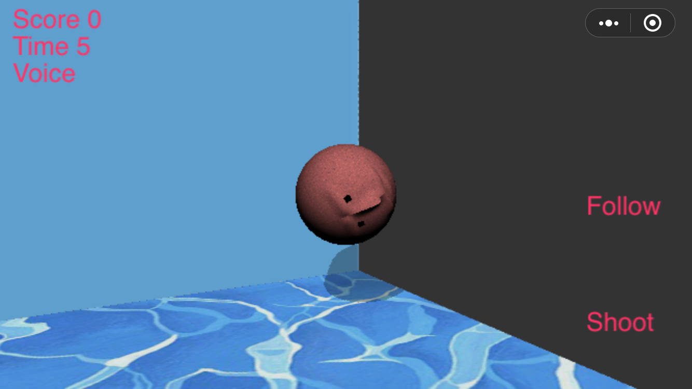
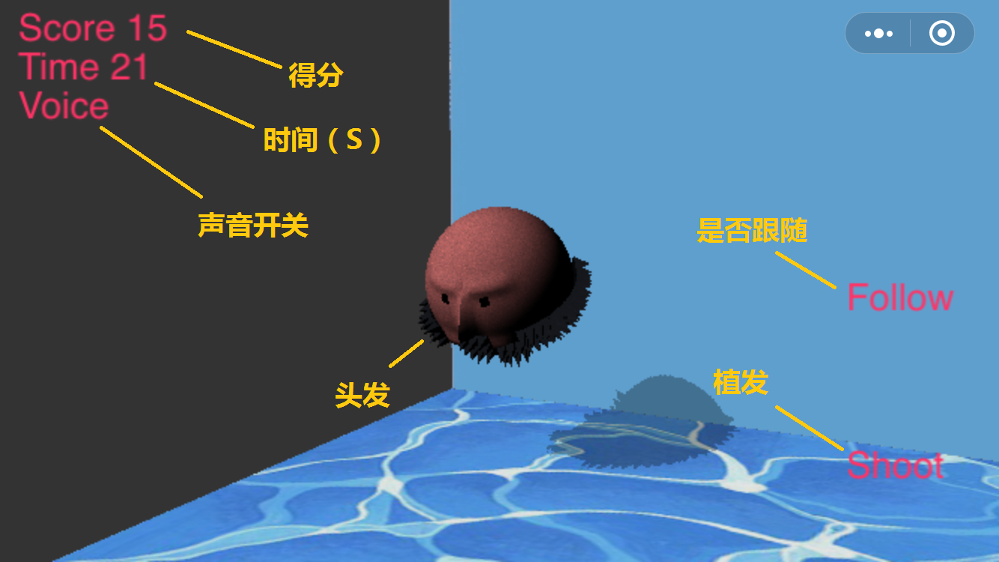

# Hair_transplant_Simulator
no transplant no hair（植发模拟）

##技术栈：
* 前端：微信小程序
* 后端：暂无

## 软件截图：
 


## 项目特点：
* 体积小
* 基于源生WebGL开发
* 对底层微信API依赖较少

## 目录结构说明：
```
├─client # 游戏端代码
│   ├─js # 游戏资源
│   ├─resourcess # 各个页面代码的存放处
│   ├─game.js # 全局JS
│   ├─game.json # 全局配置
└─project.config.json # 项目配置   

```


## 后续计划：
```
1、安卓和IOS的JS引擎不同，底层实现不同，当前仅开发出了IOS版，安卓版的开发是后续主要任务
2、游戏模型的美化，因为是我自己做的，看起来很劣质不怎么可爱呢
3、头发散列布局模型和算法的优化
4、服务端制作，这个交互性不难，所以不是很要紧的任务
```

## dududu：
Have a nice day!

